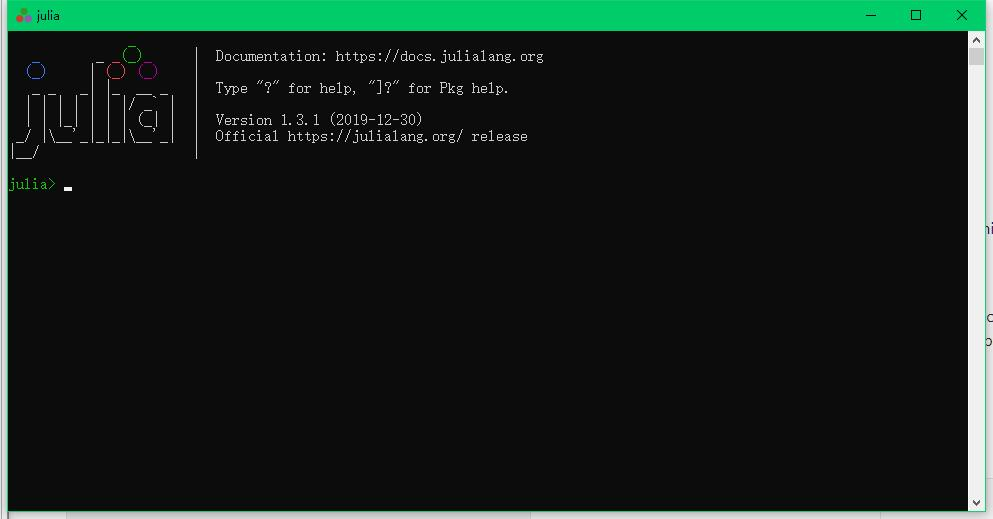

# Gandi.jl #

肝帝

## 环境配置 ##

1. 安装Python 3
2. 安装依赖
	```
	pip install numpy opencv-python PyAutoGUI
	```
3. 安装Julia
4. 安装依赖
	- 进入Julia REPL
	- 输入']'进入包管理提示符，运行如下指令(可能需要全局代理)
	```
	add Images ImageMagick ImageFeatures PyCall Dates Statistics
	```

5. 配置PyCall，使用系统默认Python环境而不是Julia Conda环境
	- 按退格键回到Julia REPL
	- 运行 
	```
	ENV["PYTHON"]="python"
	```
	- 输入']'进入包管理提示符，运行如下指令
	```
	build PyCall
	```
## 环境配置傻瓜版
### 配置Python3
[下载地址](https://www.python.org/downloads/ "下载地址")


- 下载对应版本后进入安装勾选红圈的checkbox
- 点击 **install now** <br>
这也会同时安装pip

然后打开命令行，检查一下python和pip是否正确安装


输入`python`显示如下则正确安装<br>


输入`quit()`<br>

再输入`pip`<BR>
显示如下则pip正确安装


安装python所需的包

执行`pip install xxx（这里是package name）`

所需的包：
- numpy
- pyautogui
- opencv-python

### 配置Julia
[下载地址](https://julialang.org/downloads/ "下载地址")


下载完成安装打开REPL<br>



输入`]`进入包管理模式<br>


安装命令 `add xxx`<br>

所需的包:
- Dates
- Statistics
- PyCall
- Images
- ImageFeatures
- ImageMagick


----------

配置PyCall的环境变量<br>
输入`ctrl+c`
退出包管理模式

输入ENV["PYTHON"]="python"<br>


再次 `]`进入包管理

输入`build PyCall`<br>
重新构建PyCall


